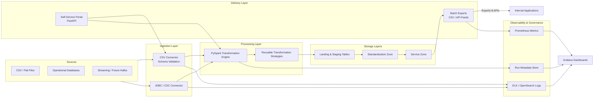

# Data Lake Application – High-Level Design

## 1. Purpose and Scope
Build a cloud-ready Data Hub that ingests, transforms, and distributes data across internal applications at scale. The hub must orchestrate thousands of daily file exchanges, support diverse transformation patterns, and surface operational insights through dashboards.

## 2. Technology Stack
- **Compute & Processing**: Python, PySpark (primary), Pandas (lightweight jobs), NumPy (vectorized utilities)
- **Service Interfaces**: FastAPI (REST APIs), Flask (dashboard server or embedded UI)
- **Storage**: Hive-backed data lake (metastore + distributed object storage), optional companion object storage for raw files
- **Containerization**: Docker images per service (ingestion workers, orchestration service, dashboard, utility jobs)
- **Messaging / Scheduling**: Airflow or managed workflow service for job orchestration; Kafka (optional) for streaming extensions
- **Observability**: Prometheus for metrics, OpenSearch/ELK for logs, Grafana for dashboards
- **Secrets & Config**: Vault or cloud secrets manager; Git-backed configuration versioning

## 3. Logical Architecture
- **API & Orchestration Layer**
  - Pipeline Registry Service: CRUD APIs over XML pipeline definitions, validation, and versioning.
  - Job Orchestrator: Executes job pipelines, resolves dependencies, schedules runs (integrated with Airflow DAGs).
  - Self-Service Portal: Guided wizard (FastAPI backend with UI) that validates inputs, scaffolds XML, and commits changes through approval workflows.
- **Ingestion Layer**
  - **CSV Connector**: Streams files from SFTP/object storage to landing zones; schema validation using PySpark `DataFrameReader`.
  - **Database Connector**: Incremental extraction through JDBC readers or CDC integration.
- **Processing Layer (PySpark Cluster)**
  - **Transformation Engine**: Executes pipeline steps (deduplication, sorting, join, lookup, merge, rollup, masking) as reusable PySpark operators.
  - **Template Method Pattern**: Each pipeline inherits the base `SparkPipeline` template that manages session lifecycle, logging, and commits.
  - **Strategy Pattern**: Each transformation step is a strategy, allowing dynamic selection based on XML configuration.
- **Storage & Data Management**
  - **Staging Layer**: Raw/table-aligned Hive tables mirroring source schema.
  - **Standardization Layer**: Curated tables with cleansed, standardized formats.
  - **Service Layer**: Presentation tables powering downstream extracts or APIs.
  - **Metadata Store**: Hive metastore augmented by MongoDB (or Hive) tables for pipeline/job metadata & run history.
- **Delivery Layer**
  - **Batch Exports**: PySpark writers to CSV, partitioned by business keys; output placed into application-specific service directories.
  - **Services**: FastAPI endpoints for data pulls and on-demand export requests.
- **Observability & Governance**
  - Unified logging (structured JSON) flowing to ELK.
  - Metrics collector to Prometheus; Grafana dashboard highlights throughput, success/failure counts, SLA adherence.
  - Data masking policies enforced via configuration-driven transformations with reversible tokenization where required.

### 3.1 Data Flow Diagram



**Flow Summary**
- External sources (files, databases, future streaming) pass through dedicated connectors that enforce schema and quality gates before landing in the data lake.
- The PySpark engine orchestrates transformation strategies, writing curated data across staging, standardization, and service layers.
- Batch exports, APIs, and the self-service portal distribute service-layer data to consuming applications while feeding operational telemetry.
- Metrics, logs, and run metadata converge into observability platforms to power dashboards and governance workflows.

## 4. Pipeline Configuration Model
### 4.1 XML Pipeline Definition
Each data pipeline is defined in XML, stored per application and layer. Schema highlights:

```xml
<pipeline id="customer_staging_load" version="1.0" layer="staging">
  <metadata>
    <owner>customer-team</owner>
    <sla>PT2H</sla>
    <schedule>0 * * * *</schedule>
  </metadata>
  <sources>
    <csv id="customer_csv" path="s3://landing/customer/*.csv" header="true" delimiter="," inferSchema="false" loadPolicy="onDemand">
      <schemaRef>schemas/customer_staging.avsc</schemaRef>
    </csv>
    <database id="customer_db" jdbcUrl="jdbc:mysql://host/db" fetchSize="10000" loadPolicy="onDemand" schemaRef="schemas/customer_db.json">
      <sql><![CDATA[
        SELECT customer_id, status, updated_at
        FROM customer
        WHERE updated_at >= :runDate
      ]]></sql>
      <!-- Omit <sql> and provide <table name="..."/> for simple full-table loads -->
    </database>
  </sources>
  <transformations>
    <deduplicate source="customer_csv" keys="customer_id" keep="latest"/>
    <sort source="customer_csv" orderBy="customer_id"/>
    <join left="customer_csv" right="customer_db" type="left" condition="customer_csv.customer_id = customer_db.id"/>
    <lookup source="customer_csv" reference="country_dim" outputFields="country_name"/>
    <mask source="customer_csv" columns="ssn,email" strategy="tokenize"/>
    <aggregate source="customer_csv" groupBy="country_name" metrics="count:customers,sum:revenue"/>
  </transformations>
  <targets>
    <hive table="staging.customer_snapshot" mode="append" partitionBy="ingest_date" schemaRef="schemas/staging/customer_snapshot.avsc"/>
    <csv path="service/customer/export/%Y/%m/%d" mode="overwrite" compression="gzip"/>
    <database id="crm_service" jdbcUrl="jdbc:sqlserver://crm-host/db" mode="merge" writeBatchSize="5000" schemaRef="schemas/service/crm_export.json">
      <table name="dbo.customer_service_snapshot"/>
    </database>
  </targets>
</pipeline>
```

Key design considerations:
- **XSD Validation**: XSD enforces transformation ordering rules and optional/required attributes.
- **Reusable References**: `<schemaRef>` on files, databases, and targets reference the schema artifacts housed under application-level `config/.../schemas`.
- **Flexible Database Reads/Writes**: `<database>` sources may specify inline `<sql>` (with parameter binding) or fall back to `<table name="..."/>` for full-table ingestion. Targets can write to database tables using `mode` semantics consistent with Spark JDBC writers.
- **Extensibility**: New transformation nodes can be plugged in without altering orchestrator code (Strategy pattern).

#### Element Attribute Reference
- `pipeline`
  - `id`: unique string scoped to the application.
  - `version`: semantic version string (`major.minor.patch`).
  - `layer`: `staging | standardization | service`.
- `metadata`
  - `<owner>`: team or application identifier.
  - `<sla>`: ISO-8601 duration (`PT2H`, `P1D`).
  - `<schedule>`: cron expression (`minute hour day-of-month month day-of-week`).
- `csv` (source/target)
  - `id`: reference name used in transformations (sources only).
  - `path`: object storage or filesystem URI with optional wildcards.
  - `header`: `true | false`.
  - `delimiter`: single-character delimiter (`,`, `|`, `\t`, etc.).
  - `inferSchema`: `true | false` (sources).
  - `compression`: `gzip | bzip2 | snappy | none` (targets optional).
  - `mode`: `append | overwrite | ignore | error` (targets).
  - `loadPolicy`: `eager | onDemand` (sources; controls when the engine materialises the dataset).
  - `<schemaRef>`: relative path under the layer-specific `schemas/` directory.
- `database` (source/target)
  - `id`: reference name (sources) or logical sink identifier (targets).
  - `jdbcUrl`: full JDBC connection string.
  - `userSecretRef`: name of credentials secret (optional).
  - `fetchSize` / `writeBatchSize`: positive integer tuning batched reads/writes.
  - `loadPolicy`: `eager | onDemand` (sources).
  - `mode`: `append | overwrite | merge | truncateInsert` (targets).
  - `isolationLevel`: `READ_COMMITTED | READ_UNCOMMITTED | REPEATABLE_READ | SERIALIZABLE` (optional).
  - `<sql>`: custom query body wrapped in CDATA (sources) supporting named parameters (`:runDate`).
  - `<table name="schema.table_name"/>`: alternative to `<sql>` for table-level operations.
  - `<schemaRef>`: relative schema definition path under the appropriate layer.
- `hive` (target)
  - `table`: fully qualified Hive table (e.g., `staging.customer_snapshot`).
  - `mode`: `append | overwrite | merge`.
  - `partitionBy`: comma-separated list of partition columns.
  - `format`: optional storage format override (`parquet | orc | delta`).
  - `<schemaRef>`: schema definition path used for enforcement/validation.
- `deduplicate`
  - `source`: source dataset id.
  - `keys`: comma-separated business keys.
  - `keep`: `first | last | latest`.
- `sort`
  - `source`: dataset id to sort.
  - `orderBy`: comma-separated columns.
  - `direction`: `asc | desc` (optional; `asc` default).
  - `nulls`: `first | last` (optional).
- `join`
  - `left`: left dataset id.
  - `right`: right dataset id.
  - `type`: `inner | left | right | full | semi | anti`.
  - `condition`: SQL-like expression referencing datasets.
- `lookup`
  - `source`: dataset id to enrich.
  - `reference`: lookup table id (resolves via metadata catalog).
  - `outputFields`: comma-separated columns to append.
  - `joinType`: `left | inner` (optional; `left` default).
- `mask`
  - `source`: dataset id to mask.
  - `columns`: comma-separated sensitive column names.
  - `strategy`: `tokenize | hash | redact | encrypt`.
  - `secretRef`: key management reference for reversible strategies (optional).
- `aggregate`
  - `source`: dataset id.
  - `groupBy`: comma-separated grouping columns.
  - `metrics`: comma-separated aggregator definitions (`count:alias`, `sum:revenue`, `avg:balance`, `max:updated_at`, `min:created_at`).
  - `window`: optional window specification (`daily`, `weekly`, cron-like) for rolling aggregates.

### 4.2 Job Pipeline Definition
Job pipelines chain multiple data pipelines with dependencies and failure policies.

```xml
<jobPipeline id="customer_master" version="2.0">
  <pipelines>
    <pipelineRef id="customer_staging_load" onFailure="retry" maxRetries="2"/>
    <pipelineRef id="customer_standardization" dependsOn="customer_staging_load" onFailure="halt"/>
    <pipelineRef id="customer_service_export" dependsOn="customer_standardization" onFailure="continue"/>
  </pipelines>
  <notifications>
    <email to="ops@company.com" on="failure"/>
    <webhook url="https://hooks.slack.com/services/..." on="completion"/>
  </notifications>
</jobPipeline>
```

- **Dependency Graph**: Converted to DAG (executed via Airflow) ensuring no cycles.
- **Failure Handling Strategies**: `retry`, `halt`, `skip`, `continue`, optionally `fallback`.
- **Parameterization**: Job-level variables (e.g., run-date) injected into pipelines.

## 5. Repository & Folder Structure

```
datalake/
├── docker/
│   ├── orchestration.Dockerfile
│   ├── pipeline-runner.Dockerfile
│   └── dashboard.Dockerfile
├── infra/
│   ├── terraform/                # Infrastructure as code (Spark cluster, storage, Kafka, etc.)
│   └── helm/                     # Kubernetes deployment charts
├── services/
│   ├── orchestrator/             # FastAPI orchestration service
│   ├── dashboard/                # Flask UI for operational metrics
│   ├── self_service/             # Portal backend and UI assets for guided pipeline creation
│   └── workers/                  # PySpark job launcher and utility binaries
├── libs/
│   ├── pipeline_core/            # Base Spark pipeline template, step registry, XML parser
│   ├── connectors/               # CSV, JDBC, and future source/sink connectors
│   └── transformations/
│       ├── deduplicate/
│       │   └── deduplicate.py
│       ├── sort/
│       │   └── sort.py
│       ├── join/
│       │   └── join.py
│       ├── lookup/
│       │   └── lookup.py
│       ├── merge/
│       │   └── merge.py
│       ├── aggregate/
│       │   └── aggregate.py
│       └── mask/
│           └── mask.py
├── config/
│   ├── common/
│   │   ├── schemas/              # Shared schema definitions (Avro, JSON schema)
│   │   └── lookups/              # Shared lookup tables or references
│   └── applications/
│       └── <appName>/
│           ├── staging/
│           │   ├── pipelines/    # XML pipeline definitions for staging
│           │   ├── jobs/         # XML job pipeline bundles for staging runs
│           │   ├── schemas/      # Layer-specific schemas referenced by staging pipelines
│           │   └── resources/    # Source-specific configs (ingestion endpoints, credentials references)
│           ├── standardization/
│           │   ├── pipelines/
│           │   ├── jobs/
│           │   ├── schemas/
│           │   └── resources/
│           └── service/
│               ├── pipelines/
│               ├── jobs/
│               ├── schemas/
│               └── resources/
├── data/
│   └── applications/
│       └── <appName>/
│           ├── staging/          # Source ingests for the app (raw tables/files)
│           ├── standardization/  # Refined, standardized datasets
│           └── service/          # Published outputs ready for distribution
├── scripts/                      # CLI utilities (config validation, job triggers)
├── docs/
│   └── high-level-design.md
└── tests/
    ├── unit/
    └── integration/
```

**Configuration Segregation**
- Application-specific directories encapsulate input/output/pipeline configuration per app.
- Layer subfolders enforce lifecycle separation: staging (ingestion), standardization (transform), service (exports).
- Each layer houses a dedicated `schemas/` directory so XML definitions can resolve to the correct physical schema artifacts without cross-layer coupling.
- Data lake outputs persist under `data/applications/<appName>/...`, keeping operational artifacts alongside their owning configuration for lifecycle management.
- Git branching strategy and tagging manage configuration versions for deployments.

## 6. Scalability & Performance Strategies
- **Distributed Execution**: PySpark on a Kubernetes-backed cluster or managed Spark service; auto-scaling worker nodes based on queue depth.
- **Partitioning & Pruning**: Partition Hive tables by frequently queried columns (e.g., ingest_date) to minimize scan cost.
- **Caching & Broadcast Join**: Use Spark caching for repeated datasets; broadcast dimension tables for faster joins.
- **Vectorized Operations**: Use Pandas/NumPy only for small data or control-plane logic; delegate heavy lifting to Spark.
- **Asynchronous I/O**: Parallel ingestion from multiple file sources; multi-threaded download/upload using asyncio or Spark parallelism.
- **Containerized Isolation**: Separate Docker images per service; orchestrate with Kubernetes for horizontal scaling.
- **Template & Strategy Patterns**: Ensure new transformations plug in without code duplication; maintain performance-tuned implementations.

## 7. Operational Monitoring & Run History
- **Run Metadata Store**: Each pipeline run emits start/end timestamps, row counts, success/failure flags, error reasons, SLA status into a `ops.pipeline_runs` Hive table.
- **Metrics Aggregation**: Airflow DAGs push run summaries to Prometheus (e.g., `pipeline_runs_total`, `pipeline_failures_total`, `pipeline_duration_seconds`).
- **Dashboard**: Grafana board pulling from Prometheus and Hive (via SQL connector) to show:
  - Runs per day/week by pipeline and application
  - Success vs. failure counts with drill-down into error messages
  - SLA compliance rates
  - Top failure reasons aggregated by category
- **Alerting**: SLA breach or repeated failure triggers Slack/email/webhook notifications.
- **Traceability**: Unique run IDs propagate through logs, metrics, and stored data for lineage tracking.

## 8. Security, Governance, and Compliance
- **Data Masking**: Tokenization, hashing, or encryption strategies defined per column in XML; executed as transformations before data leaves secure zones.
- **Access Control**: Fine-grained permissions per application folder; service accounts use least privilege when interacting with data lake and secrets.
- **Audit Logging**: All configuration changes logged, versioned, and auditable via Git and metadata tables.
- **Schema Governance**: Schema registry ensures producers/consumers adhere to contracts; automatic schema drift detection.

## 9. Deployment & DevOps
- **CI/CD**: Automated linting, unit tests, XML schema validation, and integration tests on pull requests.
- **Artifact Management**: Docker images published to registry with semantic tags; Spark jobs packaged as wheel files or zip bundles.
- **Environment Promotion**: Dev → QA → Prod using configuration overlays; Airflow DAGs parameterized by environment.
- **Disaster Recovery**: Metadata and Hive tables replicated across regions; raw files retained in immutable storage with lifecycle policies.

## 10. Future Enhancements
- Real-time ingestion module via Spark Structured Streaming and Kafka.
- Machine-learning powered anomaly detection on pipeline metrics for proactive alerting.
- Data quality rules engine integrated with transformations (e.g., Great Expectations).

For a complete log of prompts and responses influencing this document, refer to `docs/prompts-of-high-level-design.md`.
